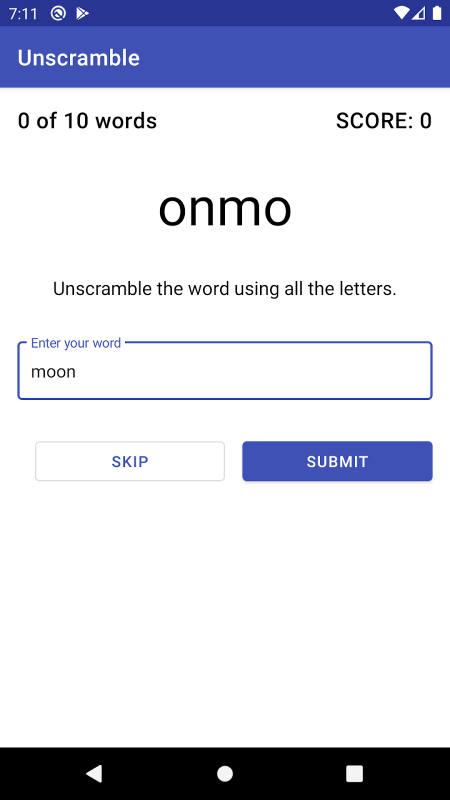
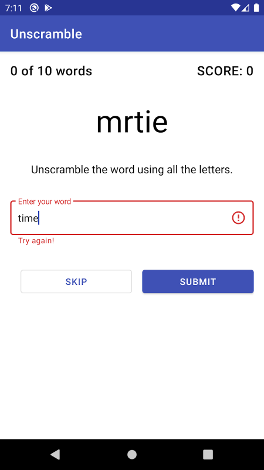
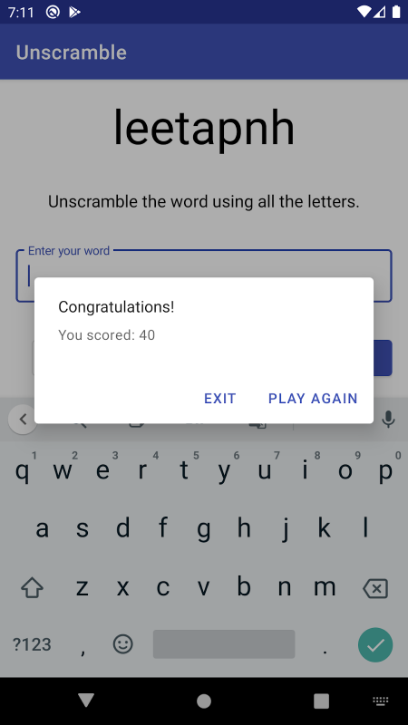

# Unscramble App
#### [Android Basics in Kotlin](https://developer.android.com/courses/android-basics-kotlin/course) - [Unit 3](https://developer.android.com/courses/android-basics-kotlin/unit-3) - [Pathway 2](https://developer.android.com/courses/pathways/android-basics-kotlin-unit-3-pathway-2) - [Activity 2](https://developer.android.com/codelabs/basic-android-kotlin-training-viewmodel#0) - Store data in ViewModel
The codelab walks us through how to use ViewModel for storing data. I had previously taken a class that covered using viewModels, but this course covered things in more detail. Like the following text copied from the fourth section of the codelab is something I didn't know before, but had wondered about:
### Learning Snippet
#### Kotlin property delegate

In Kotlin, each mutable (`var`) property has default getter and setter functions automatically generated for it. The setter and getter functions are called when you assign a value or read the value of the property.

For a read-only property (`val`), it differs slightly from a mutable property. Only the getter function is generated by default. This getter function is called when you read the value of a read-only property.

Property delegation in Kotlin helps you to handoff the getter-setter responsibility to a different class.

This class (called delegate class) provides getter and setter functions of the property and handles its changes.

A delegate property is defined using the `by` clause and a delegate class instance:
```text
// Syntax for property delegation
var <property-name> : <property-type> by <delegate-class>()
```
In your app, if you initialize the view model using default `GameViewModel` constructor, like below:
```kotlin
private val viewModel = GameViewModel()
```
Then the app will lose the state of the `viewModel` reference when the device goes through a configuration change. For example, if you rotate the device, then the activity is destroyed and created again, and you'll have a new view model instance with the initial state again.

Instead, use the property delegate approach and delegate the responsibility of the `viewModel` object to a separate class called `viewModels`. That means when you access the `viewModel` object, it is handled internally by the delegate class, `viewModels`. The delegate class creates the `viewModel` object for you on the first access, and retains its value through configuration changes and returns the value when requested.
## Summary
The codelab had us work with code provided in the `starter` branch and has us follow along step by step setting it up to use a ViewModel. The app is still incomplete with the completion of the codelab, as it will be completed in other codelabs. Summary of the app so far, provided in 12th topic of the codelab:    
### App Summary
This is what your final app should look like. The game shows ten random scrambled words for the player to unscramble. You can either **Skip** the word or guess a word and tap **Submit**. If you guess correctly, the score increases. An incorrect guess shows an error state in the text field. With each new word, the word count also increases.

Note that the score and word count displayed on screen do not update yet. But the information is still being stored in the view model and preserved during configuration changes like device rotation. You will update the score and word count on screen in later codelabs.    
    
        
At the end of 10 words, the game is over and an alert dialog pops up with your final score and an option to exit the game or play again.    
    
### Learning Summary
#### From section 14 of codelab:
* The Android app architecture guidelines recommend separating classes that have different responsibilities and driving the UI from a model.
* A UI controller is a UI-based class like `Activity` or `Fragment`. UI controllers should only contain logic that handles UI and operating system interactions; they shouldn't be the source of data to be displayed in the UI. Put that data and any related logic in a `ViewModel`.
* The `ViewModel` class stores and manages UI-related data. The `ViewModel` class allows data to survive configuration changes such as screen rotations.
* ViewModel is one of the recommended Android Architecture Components.


