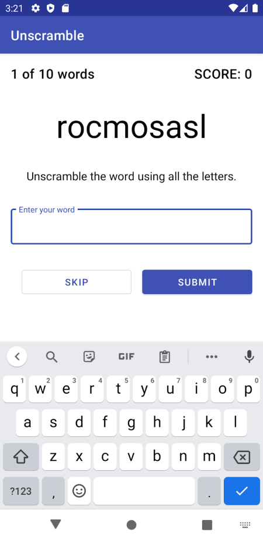
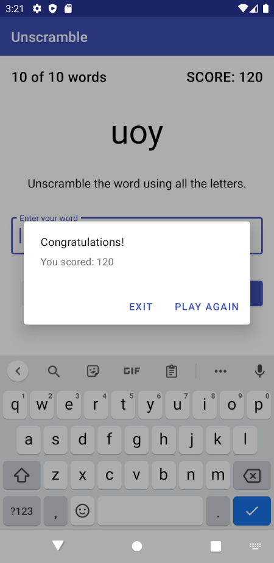

# Unscramble App
#### [Android Basics in Kotlin](https://developer.android.com/courses/android-basics-kotlin/course) - [Unit 3](https://developer.android.com/courses/android-basics-kotlin/unit-3) - [Pathway 2](https://developer.android.com/courses/pathways/android-basics-kotlin-unit-3-pathway-2) - [Activity 3](https://developer.android.com/codelabs/basic-android-kotlin-training-livedata#0) - Use LiveData with ViewModel
The codelab walks us through how to use Livedata with View binding and Data binding. The code for the app was updated to what we did for the codelab with a few adjustments:
* I changed in GameViewModel.kt how the words were selected and reset ( I wanted it to not repeat words until it has used up all available words ). And added an extra word to allWordsList so that it would be evenly divisible by 10.
* The step in the codelab to get Talkback to work, didn't work for my phone, so I found a solution on stackoverflow that did work for it. 

### Learning Summary
#### From section 13 of codelab:
* `LiveData` holds data; `LiveData` is a wrapper that can be used with any data
* `LiveData` is observable, which means that an observer is notified when the data held by the `LiveData` object changes.
* `LiveData` is lifecycle-aware. When you attach an observer to the `LiveData`, the observer is associated with a `LifecycleOwner` (usually an Activity or Fragment). The LiveData only updates observers that are in an active lifecycle state such as `STARTED` or `RESUMED`. You can read more about LiveData and observation [here](https://developer.android.com/topic/libraries/architecture/livedata.html#work_livedata).
* Apps can listen to the LiveData changes from the layout using Data Binding and binding expressions.
* Binding expressions are written within the layout in the attribute properties (such as `android:text`) referencing the layout properties.
### App Summary
This is what your final app should look like. The game shows ten random scrambled words for the player to unscramble. You can either **Skip** the word or guess a word and tap **Submit**. If you guess correctly, the score increases. An incorrect guess shows an error state in the text field. With each new word, the word count also increases.

    
        
At the end of 10 words, the game is over and an alert dialog pops up with your final score and an option to exit the game or play again.    
